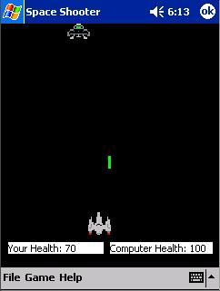



## Space Shooter \- A complete game for Windows CE \(Pocket PC\)

### Description

This is a complete game I created for learning purposes. It's a little corny, but I think it's still cool. It has collision data if you need it. This code also shows you how to play wav files, use picture files, hardware key inputs, and AI! I'm looking forward to your comments and feedback and I will be updating this game from time to time. Check in the future.

Well commented!

Please take some time to vote... I would really like to see how well I did on my very first game.

Happy programming! &#220;

Directions how to get to work for people who don't know how to extract properly (shocking!)

1. Download zip

2. Extract all files in one folder

3. Copy that folder to your pocket pc

4. Tap on Space_Shooter.vb

5. Have fun!

If you get errors getting it to work, let me know so that I can help fix the problem.
 
### More Info
 

             |
---                |---
**Submitted On**   |2005-02-27 15:06:16
**By**             |[Daniel Harris](https://github.com/Planet-Source-Code/PSCIndex/blob/master/ByAuthor/daniel-harris.md)
**Level**          |Intermediate
**User Rating**    |5.0 (10 globes from 2 users)
**Compatibility**  |VB 3\.0
**Category**       |[Windows CE](https://github.com/Planet-Source-Code/PSCIndex/blob/master/ByCategory/windows-ce__1-41.md)
**World**          |[Visual Basic](https://github.com/Planet-Source-Code/PSCIndex/blob/master/ByWorld/visual-basic.md)
**Archive File**   |[Space\_Shoo1858452282005\.zip](https://github.com/Planet-Source-Code/daniel-harris-space-shooter-a-complete-game-for-windows-ce-pocket-pc__1-58866/archive/master.zip)

